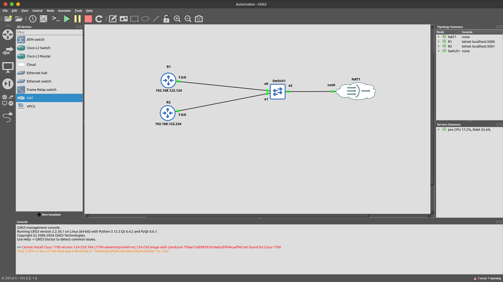
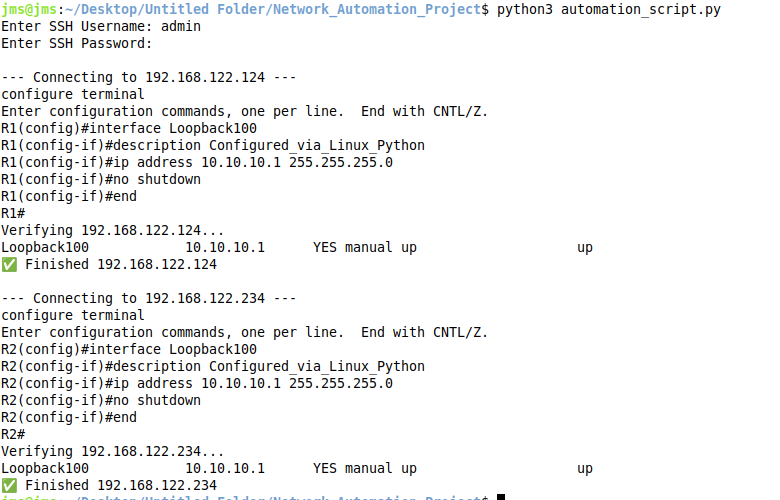
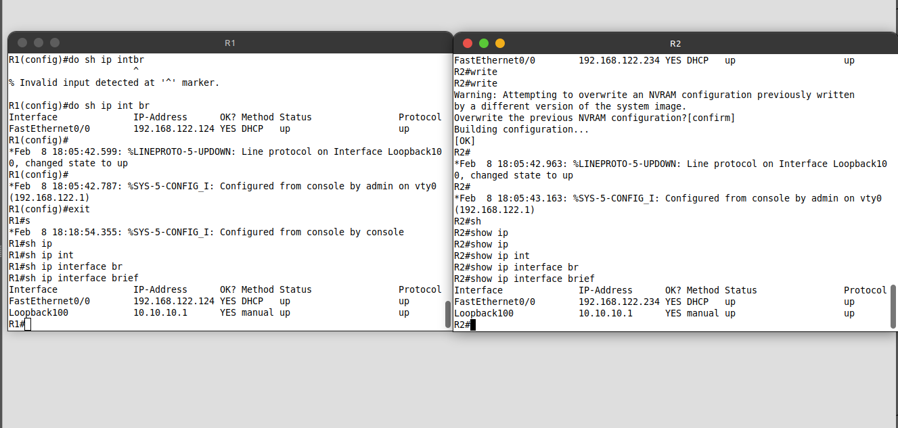

# 🐍 Automated Network Configuration with Python & Netmiko

## 📖 Executive Summary
This project demonstrates modern network programmability by automating the configuration of Cisco IOS devices using **Python** and the **Netmiko** library. It replaces manual CLI interaction by programmatically pushing standard configurations via SSH across multiple devices simultaneously.

The project was built and tested in a **GNS3** virtual environment bridged to a Linux host, simulating a live production network management scenario.

---

## 🏗️ Network Topology & Architecture
*(Add your `topology.png` screenshot to the `src` folder)*

### Infrastructure Breakdown
* [cite_start]**Target Devices:** 2x Cisco c7200 Routers (R1 and R2) running IOS 15.2[cite: 85, 98, 135].
* [cite_start]**Network Switch:** An unmanaged Ethernet switch connecting the routers to the management cloud[cite: 109, 110].
* [cite_start]**Management Cloud (NAT):** A GNS3 NAT node mapping to the `virbr0` interface, providing DHCP IP addresses (`192.168.122.x`) to the routers so the Linux host can reach them via SSH[cite: 53, 55, 129, 139].

---

## ⚙️ Core Features & Script Logic
The automation script (`automation_script.py`) is designed for scalability and security:
1. **Secure Credential Handling:** Uses the `getpass` module to securely prompt the engineer for SSH passwords without hardcoding them into the script.
2. **Dynamic Inventory:** Reads target IP addresses dynamically from a `devices.txt` file (Targets: `192.168.122.124` and `192.168.122.234`).
3. **Configuration Push:** Establishes an SSH connection using Netmiko's `ConnectHandler` and sends a predefined list of commands to create `Loopback100` with the IP `10.10.10.1/24`.
4. **Automated Verification:** Immediately runs `show ip int brief | include Loopback` to verify the configuration was successfully applied before closing the connection.

---

## 🚀 Execution & Verification

### 1. Script Execution
*(Add your `execution.png` screenshot to the `src` folder)*

*The script successfully authenticates, pushes the Loopback configuration, and verifies the interface status on both R1 and R2 sequentially.*

### 2. Router Data Plane Verification
*(Add your `verification.png` screenshot to the `src` folder)*

*Manual verification on the CLI confirms the `Loopback100` interfaces are active and the DHCP management IPs remain stable.*

---

## 💡 Challenges & Solutions

During the development and execution of this project, several engineering challenges were encountered and resolved:

### 🔴 Challenge 1: Bridging the Virtual and Physical Networks
* **Problem:** The Python script running on the Linux host could not inherently reach the virtual routers isolated inside the GNS3 environment.
* **Solution:** Deployed a GNS3 NAT node attached to the Linux `virbr0` interface. [cite_start]Configured the routers' `FastEthernet0/0` interfaces to request IPs via DHCP (`ip address dhcp`), successfully placing them on the host's `192.168.122.0/24` subnet for direct SSH access[cite: 129, 139, 148].

### 🔴 Challenge 2: Secure Credential Management
* **Problem:** Hardcoding administrative passwords into the Python script poses a severe security risk if the code is uploaded to a repository like GitHub.
* **Solution:** Imported the built-in `getpass` Python module. This prompts the user to enter the SSH password at runtime, obscuring the keystrokes and keeping sensitive data completely out of the source code.

### 🔴 Challenge 3: RSA Key Generation & SSH Readiness
* **Problem:** Netmiko scripts failed to connect initially because Cisco routers default to Telnet or lack the cryptography keys required for SSHv2.
* [cite_start]**Solution:** Prepared the routers manually by defining a domain name (`ip domain name lab.local`), generating 1024-bit RSA crypto keys, and explicitly configuring the VTY lines for local login and SSH transport (`transport input ssh`)[cite: 136, 141, 146, 150].
